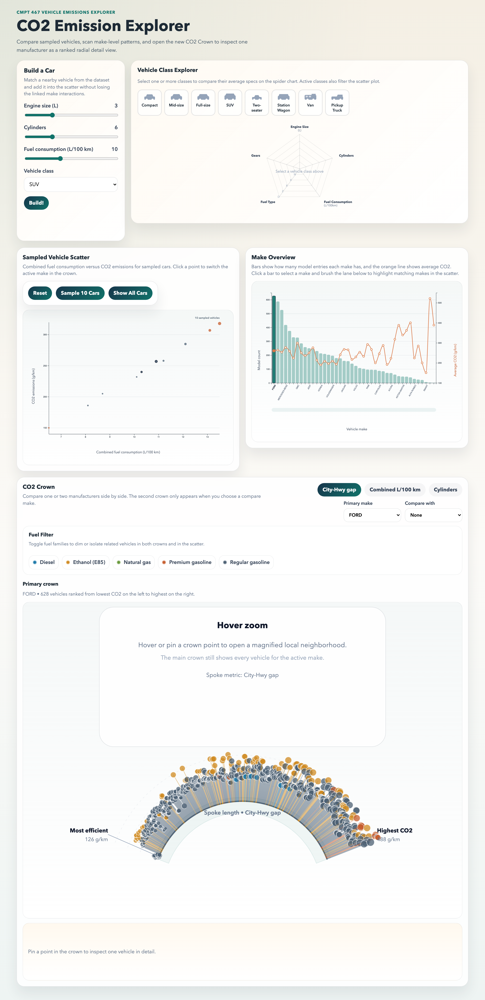

# CO2 Emission Explorer

A D3.js interactive visualization project for **CMPT 467** focused on helping users explore vehicle fuel consumption and CO2-emission tradeoffs.

The project combines several coordinated views so a user can move from broad comparison to detailed inspection: first comparing vehicle classes, then scanning the larger fuel-versus-emissions space, then drilling into manufacturer-level patterns, and finally inspecting individual cars inside a custom radial view called the **CO2 Crown**.

**Documentation**

- [Final Report (PDF)](Documentation/report.pdf)
- [Report Source (LaTeX)](Documentation/report.tex)



## Project Highlights

- **Build a Car** lets the user specify approximate engine size, cylinder count, fuel consumption, and class, then find a nearby real vehicle from the dataset.
- **Vehicle Class Explorer** compares broader classes such as compact, SUV, van, and pickup using a radar chart.
- **Sampled Vehicle Scatter** shows individual vehicles in fuel-consumption versus CO2 space.
- **Make Overview** combines manufacturer model counts with average CO2 emissions.
- **CO2 Crown** is the project's innovative view: a ranked radial manufacturer view that arranges vehicles from lower to higher CO2 and supports side-by-side make comparison.
- **Pinned Vehicle Cards** keep exact details visible while the user continues exploring.

## Coordinated Interactions

The interface is not a set of isolated charts. Major interactions are linked across views:

- Building a custom car adds a matched vehicle into the scatterplot.
- Selecting class buttons updates the radar chart and filters the scatterplot.
- Clicking a scatter point or make in the overview changes the active make in the CO2 Crown.
- Brushing makes in the overview highlights matching vehicles in the scatter.
- Fuel-type toggles affect both the scatter and the crown.
- Compare mode opens a second crown for side-by-side manufacturer analysis.
- Hovering and pinning in the crown opens a local zoom and persistent detail cards.

## Dataset

This project uses a vehicle emissions dataset derived from:

- [Kaggle: CO2 Emission by Vehicles](https://www.kaggle.com/datasets/debajyotipodder/co2-emission-by-vehicles)

Relevant files in this repository:

- [`Original_Dataset/CO2 Emissions_Canada.csv`](Original_Dataset/CO2%20Emissions_Canada.csv): original attached dataset file
- [`Original_Dataset/Data Description.csv`](Original_Dataset/Data%20Description.csv): abbreviations, codes, and unit descriptions
- [`data.csv`](data.csv): normalized version used directly by the visualization code

The normalized dataset contains:

- 7,385 rows
- 12 columns
- vehicle make, model, class, engine size, cylinders, transmission, fuel type
- city/highway/combined fuel consumption
- combined MPG
- CO2 emissions in grams per kilometer

## Running the Project

No build step is required. The app is a static D3 site loaded through a local server.

```bash
python3 -m http.server 8000
```

Then open:

```text
http://localhost:8000
```

If port `8000` is already in use, start the server on another port, for example:

```bash
python3 -m http.server 8123
```

## Repository Structure

```text
.
├── index.html
├── data.csv
├── Original_Dataset/
│   ├── CO2 Emissions_Canada.csv
│   └── Data Description.csv
├── js/
│   ├── main.js
│   ├── data.js
│   ├── state.js
│   ├── interactions.js
│   ├── scatter.js
│   ├── barchart.js
│   ├── spider.js
│   └── crown.js
└── Documentation/
    ├── report.tex
    ├── report.pdf
    ├── pages/
    └── images/
```

## Implementation Overview

### `index.html`

- Defines the full page layout, styling, controls, and SVG containers.

### `js/main.js`

- Loads the dataset.
- Prepares shared state.
- Instantiates all views.
- Wires the top-level controls such as sampling, reset, show-all, and build-a-car.

### `js/data.js`

- Parses numeric fields.
- Computes derived values such as the city-highway gap.
- Builds manufacturer summaries.
- Samples vehicles.
- Implements nearest-match lookup for Build a Car.

### `js/state.js`

- Central application store.
- Coordinates selected makes, brushed makes, fuel filters, class filters, crown metric, and hover/pin focus state.

### `js/scatter.js`

- Renders the fuel-consumption versus CO2 scatterplot.
- Responds to class filters, make brushing, fuel filters, and crown focus.

### `js/barchart.js`

- Renders the make overview with bars for model count and a line for average CO2.
- Supports brushing and make selection.

### `js/spider.js`

- Groups raw classes into broader categories.
- Computes class-level averages.
- Renders the radar chart used in the Vehicle Class Explorer.

### `js/crown.js`

- Implements the custom **CO2 Crown** view.
- Supports metric switching, fuel filtering, compare mode, hover zoom, and pinned vehicle details.

### `js/interactions.js`

- Keeps slider labels synchronized with their current values.

## Screenshots

- [Overall Interface](Documentation/images/overall-interface.png)
- [Build a Car + Class Explorer](Documentation/images/build-class-explorer.png)
- [Scatter + Make Overview](Documentation/images/scatter-make-overview.png)
- [Linked Class Filtering](Documentation/images/linked-class-filtering.png)
- [Single CO2 Crown](Documentation/images/crown-single-ford.png)
- [Compare Mode Crown](Documentation/images/crown-compare-ford-toyota.png)
- [Pinned Vehicle Cards](Documentation/images/crown-pinned-cards.png)

## Documentation

The final project write-up is available here:

- [Final Project Report PDF](Documentation/report.pdf)

If you want the source:

- [LaTeX report source](Documentation/report.tex)
- [Title page source](Documentation/pages/titlepage.tex)

## Team

- Aryaman Bahuguna
- Mayank Mayank
- Jason Lee
